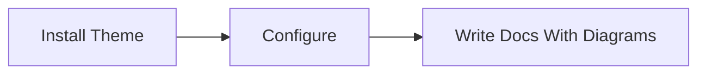
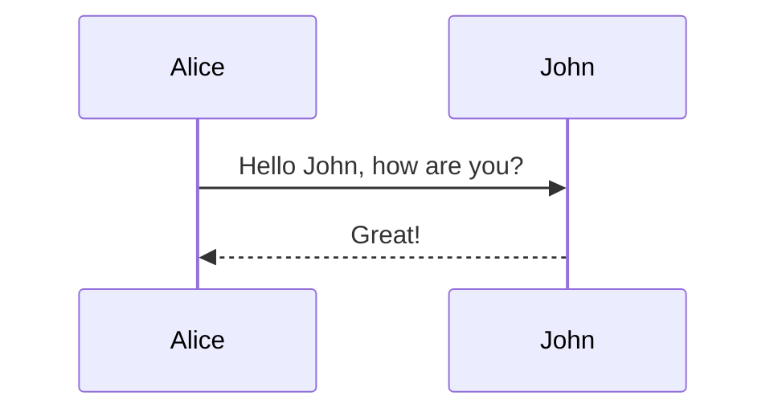
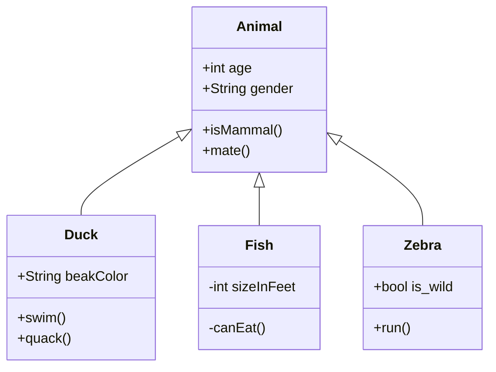
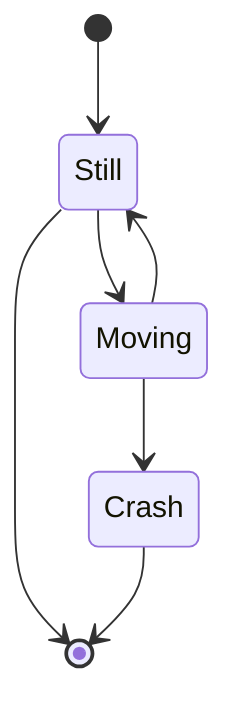
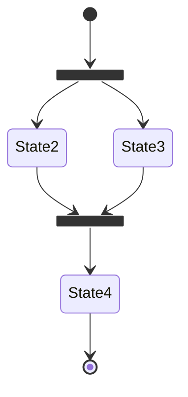
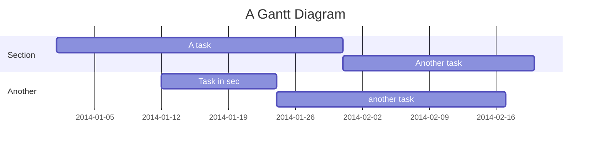

# Example Mermaid

You can add diagrams using [mermaid](https://mermaidjs.github.io/#/) e.g.:

## Flow chart

[Docs](https://mermaidjs.github.io/#/flowchart)

    ```mermaid
    graph LR
    install[Install Theme]
    install --> configure[Configure]
    configure --> draw[Write Docs With Diagrams]
    ```

gives:



## Sequence

[Docs](https://mermaidjs.github.io/#/sequenceDiagram)

    ```mermaid
    sequenceDiagram
        Alice->>John: Hello John, how are you?
        John-->>Alice: Great!
    ```

gives:



## Class diagram

[Docs](https://mermaidjs.github.io/#/classDiagram)

    ```mermaid
    classDiagram
        Animal <|-- Duck
        Animal <|-- Fish
        Animal <|-- Zebra
        Animal : +int age
        Animal : +String gender
        Animal: +isMammal()
        Animal: +mate()
        class Duck{
            +String beakColor
            +swim()
            +quack()
        }
        class Fish{
            -int sizeInFeet
            -canEat()
        }
        class Zebra{
            +bool is_wild
            +run()
        }
    ```

gives



## State diagram

[Docs](https://mermaidjs.github.io/#/stateDiagram)

    ```mermaid
    stateDiagram
        [*] --> Still
        Still --> [*]

        Still --> Moving
        Moving --> Still
        Moving --> Crash
        Crash --> [*]
    ```

gives



## TO FIX

### state with fork

    ```mermaid
    stateDiagram
        state fork_state <<fork>>
        [*] --> fork_state
        fork_state --> State2
        fork_state --> State3

        state join_state <<join>>
        State2 --> join_state
        State3 --> join_state
        join_state --> State4
        State4 --> [*]
    ```



### Gant

[Docs](https://mermaidjs.github.io/#/gantt)

    ```mermaid
    gantt
        title A Gantt Diagram
        dateFormat  YYYY-MM-DD
        section Section
        A task           :a1, 2014-01-01, 30d
        Another task     :after a1  , 20d
        section Another
        Task in sec      :2014-01-12  , 12d
        another task      : 24d
    ```

gives


